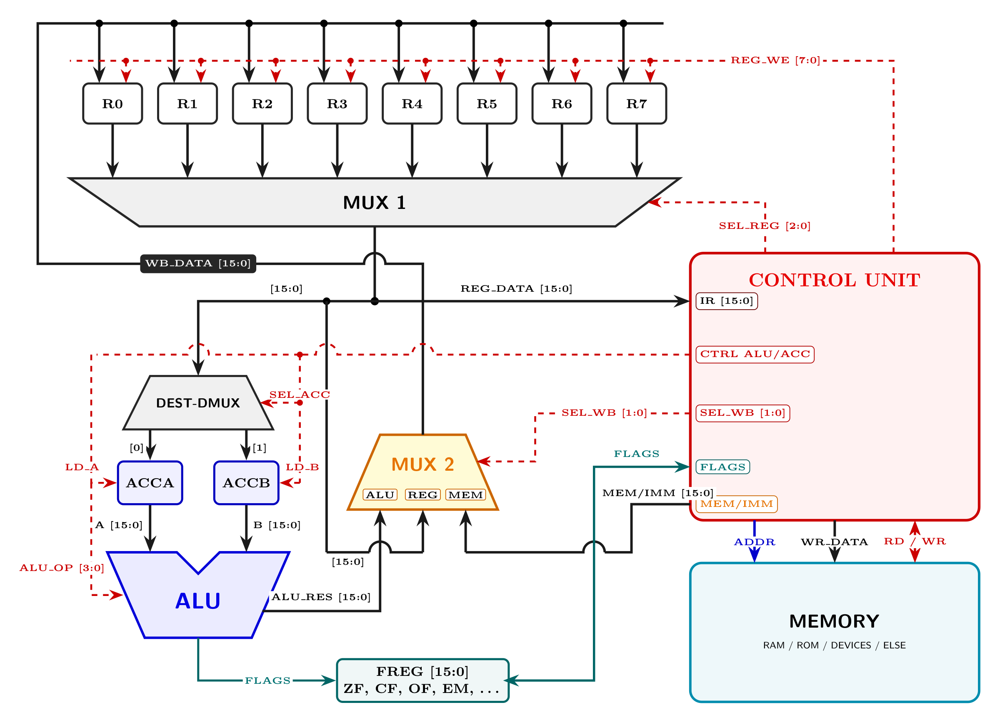

# LIM M2 Processor Architecture

<p align="center">
  
</p>

<p align="center">
  <b>High-Performance 16-Bit Microprogrammed CPU Core with Zero Tri-State Multiplexed Datapath & 24-Bit Linear Addressing (16 MB)</b>
</p>

<p align="center">
  <a href="README.md"><b>English</b></a> •
  <a href="README.ua.md"><b>Українська</b></a> •
  <a href="README.ru.md"><b>Русский</b></a> •
  <a href="README.sk.md"><b>Slovenčina</b></a>
</p>

---

## 🌟 Key Architectural Highlights

* **Pure Multiplexer Datapath (Zero Tri-State / No Hi-Z):**
  Internal buses completely discard high-impedance third-state (`Hi-Z`) lines. Data steering is implemented via active push-pull multiplexer trees (`MUX 1`, `DEST-DMUX`, `MUX 2`), entirely eliminating bus contention, floating lines, and capacitive decay. Ideal for FPGA and ASIC synthesis.
* **Extended 24-Bit Linear Memory & Stack Addressing (16 MB):**
  Features dedicated 24-bit pointer registers:
  * **`PTREG` (Pointer Register):** Linear flat addressing across 16 MB with optional hardware auto-increment (`AIP`).
  * **`SREG` (Stack Register):** Full 24-bit linear execution stack pointer supporting deep subroutine stacks and recursive frames.
* **Dual Accumulator Staging (`ACCA` & `ACCB`):**
  Dedicated 16-bit pre-ALU input latches isolate arithmetic propagation transients from the general register file (`R0–R7`).
* **Direct Register Bypass Channel (Reg-to-Reg Bypass):**
  Point-to-point datapath from `MUX 1` directly to `MUX 2` executes fast register transfers (`LRR / MOV`) without locking or stalling the ALU.
* **Hardware ALU Auto-Chaining (Multi-Word Arithmetic):**
  The ALU features an internal residual accumulator (`ALU_RESIDUAL`):
  * **Chained Addition (`ADD`):** When sum $> 2^{16}-1$, carry (`+1`) is latched and automatically added in the next `ADD`.
  * **Chained Subtraction (`SUB`):** When difference $< 0$, borrow (`-1`) is retained and automatically subtracted in the next `SUB`.
  * **Chained Multiplication (`MUL`):** Low 16 bits go to destination; upper 16 bits are retained in `ALU_RESIDUAL` and can be accumulated in following operations or extracted.
  * **Chained Division (`DIV`):** Quotient is written to destination register; remainder (modulo) is retained in `ALU_RESIDUAL`.
  * **Chain Flush (`NOP`):** Executing `NOP` flushes `ALU_RESIDUAL` and resets carry/borrow tracking for independent computations.
* **High Clock Frequency Envelope:**
  Designed for a baseline operating frequency of **200 MHz**, scaling towards **700+ MHz** in modern silicon (ASIC).

---

## 📑 Official Datasheets

Pre-compiled, ready-to-print comprehensive technical reference datasheets are located in [`Docs/`](Docs/):

| Language | LaTeX Source | Compiled PDF Specification |
| :--- | :--- | :--- |
| **English** | [`Docs/LIM_M2_Datasheet_EN.tex`](Docs/LIM_M2_Datasheet_EN.tex) | [**Download PDF (EN)**](Docs/LIM_M2_Datasheet_EN.pdf) |
| **Українська** | [`Docs/LIM_M2_Datasheet_UA.tex`](Docs/LIM_M2_Datasheet_UA.tex) | [**Download PDF (UA)**](Docs/LIM_M2_Datasheet_UA.pdf) |
| **Русский** | [`Docs/LIM_M2_Datasheet_RU.tex`](Docs/LIM_M2_Datasheet_RU.tex) | [**Download PDF (RU)**](Docs/LIM_M2_Datasheet_RU.pdf) |
| **Slovenčina** | [`Docs/LIM_M2_Datasheet_SK.tex`](Docs/LIM_M2_Datasheet_SK.tex) | [**Download PDF (SK)**](Docs/LIM_M2_Datasheet_SK.pdf) |

---

## 🗃️ Architectural Register File

| Register | Width | Architectural Role |
| :--- | :---: | :--- |
| **`R0` – `R7`** | 16-bit | General Purpose Registers (GPR). Low-latency read via `MUX 1`, gated writeback from `WB_DATA`. |
| **`SREG`** | **24-bit** | System Stack Register. Linear 24-bit addressing across 16 MB execution stack space. |
| **`PTREG`** | **24-bit** | Extended Pointer Register. Flat linear addressing across 16 MB with optional hardware auto-increment (`AIP`). |
| **`FREG`** | 16-bit | Processor Status and Control Register. Unifies condition flags and operational mode controls. |
| **`ACCA` / `ACCB`** | 16-bit | Auxiliary ALU Latches (Dual Accumulator Staging). Pre-stages ALU operands A and B. |

### Flag and Control Register (`FREG`) Bit Layout

```text
 15    14    13    12   11   10    9    8    7    6    5    4    3    2    1    0
+-----+-----+-----+----+----+----+----+----+----+----+----+----+----+----+----+----+
|INTR |SMOD |DBIT |AIP |M24 |DWR |MIE |PIE |CLK1|CLK0|CMP1|CMP0| EM | OF | CF | ZF |
+-----+-----+-----+----+----+----+----+----+----+----+----+----+----+----+----+----+
```

* **`ZF` (0):** Zero Flag (result is zero).
* **`CF` (1):** Carry / Borrow Flag.
* **`OF` (2):** Overflow Flag (signed arithmetic).
* **`EM` (3):** Error Math (hardware trap on division by zero).
* **`CMP` (4–5):** 2-bit Hardware Comparator Result (`<`, `=`, `>`).
* **`CLK` (6–7):** Core Clock Divider Mode.
* **`PIE` (8):** Program Interrupt Enable.
* **`MIE` (9):** Master Interrupt Enable.
* **`DWR` (10):** Disable Wait for Ready (forced non-blocking bus transfer).
* **`M24` (11):** 24-bit Extended Addressing Enable.
* **`AIP` (12):** Auto-Increment Pointer on memory operations.
* **`DBIT` (13):** Displaced Bit buffer (retains bit ejected during shift).
* **`SMOD` (14):** Shift Mode selector (`0`: zero-fill, `1`: cyclic rotate through `DBIT`).
* **`INTR` (15):** In-Interrupt execution flag (`1`: CPU is servicing an interrupt; subsequent interrupts locked out).

---

## ⚡ Instruction Set Architecture (ISA - 32 Opcodes)

| Opcode | Hex | Mnemonic | Class | Functional Description |
| :---: | :---: | :--- | :--- | :--- |
| **00000** | `0x00` | **`NOP`** | Control | No operation; flushes `ALU_RESIDUAL` and resets carry/borrow tracking |
| **00001** | `0x01` | **`ADD`** | Arithmetic | 16-bit addition with automatic carry chaining via `ALU_RESIDUAL` |
| **00010** | `0x02` | **`SUB`** | Arithmetic | 16-bit subtraction with automatic borrow chaining via `ALU_RESIDUAL` |
| **00011** | `0x03` | **`MUL`** | Arithmetic | Integer multiplication; upper 16 bits latched into `ALU_RESIDUAL` |
| **00100** | `0x04` | **`DIV`** | Arithmetic | Integer division; remainder (modulo) latched into `ALU_RESIDUAL` |
| **00101** | `0x05` | **`LMR`** | Memory | Load word from memory into register (supports 24-bit `PTREG`) |
| **00110** | `0x06` | **`LRM`** | Memory | Store word from register into memory |
| **00111** | `0x07` | **`LRR`** | Transfer | Fast register-to-register copy via bypass (`MUX 1` $\to$ `MUX 2`) |
| **01000** | `0x08` | **`CMP`** | Compare | Arithmetic compare; updates `FREG.CMP`, `ZF`, `CF`, `OF` non-destructively |
| **01001** | `0x09` | **`JMP`** | Branch | Unconditional branch (16-bit local or full 24-bit via `PTREG`) |
| **01010** | `0x0A` | **`JCR`** | Branch | Conditional branch on Carry Flag (`CF == 1`) |
| **01011** | `0x0B` | **`JNZ`** | Branch | Conditional branch on Non-Zero (`ZF == 0`) |
| **01100** | `0x0C` | **`JZ`** | Branch | Conditional branch on Zero (`ZF == 1`) |
| **01101** | `0x0D` | **`AND`** | Logic | Bitwise logical AND |
| **01110** | `0x0E` | **`OR`** | Logic | Bitwise logical OR |
| **01111** | `0x0F` | **`NAND`** | Logic | Bitwise logical NAND |
| **10000** | `0x10` | **`NOR`** | Logic | Bitwise logical NOR |
| **10001** | `0x11` | **`NOT`** | Logic | Bitwise NOT (One's Complement) |
| **10010** | `0x12` | **`XOR`** | Logic | Bitwise exclusive OR |
| **10011** | `0x13` | **`XNOR`** | Logic | Bitwise equivalence |
| **10100** | `0x14` | **`INC`** | Arithmetic | Atomic increment by 1 |
| **10101** | `0x15` | **`DEC`** | Arithmetic | Atomic decrement by 1 |
| **10110** | `0x16` | **`PUSH`** | Stack | Push 16-bit word onto 24-bit stack (`SREG <- SREG - 2`) |
| **10111** | `0x17` | **`POP`** | Stack | Pop 16-bit word from 24-bit stack (`SREG <- SREG + 2`) |
| **11000** | `0x18` | **`BSL`** | Shift | Barrel Shift Left (zero-fill or cyclic rotate via `DBIT` if `SMOD=1`) |
| **11001** | `0x19` | **`BSR`** | Shift | Barrel Shift Right (zero-fill or cyclic rotate via `DBIT` if `SMOD=1`) |
| **11010** | `0x1A` | **`CSRM`** | System | Control and Status Register Access (`FREG`, `PTREG`, `SREG`) |
| **11011** | `0x1B` | **`RSV27`** | Reserved | Vector / SIMD hardware extensions slot |
| **11100** | `0x1C` | **`RSV28`** | Reserved | Extended addressing coprocessor slot |
| **11101** | `0x1D` | **`RSV29`** | Reserved | Floating-Point Unit (FPU) slot |
| **11110** | `0x1E` | **`RSV30`** | Reserved | Hardware cryptography accelerator slot |
| **11111** | `0x1F` | **`RSV31`** | Reserved | Future architecture expansion slot |

---

## 🔌 Physical Interface & 34-Pin Package

The LIM M2 processor is packaged in an industry-standard 34-pin dual-row footprint engineered for signal integrity, noise immunity, and deterministic timing:

| Pin | Name | Direction | Description |
| :---: | :--- | :---: | :--- |
| **1–8** | `A0`–`A7` | Output | Multiplexed lower 8 bits of 16-bit physical address bus |
| **9–16** | `A8`–`A15` | Output | Multiplexed upper 8 bits of 16-bit physical address bus |
| **17** | `CLK1` | Input | Phase 1 system clock input |
| **18** | `CLK2` | Input | Phase 2 system clock input (non-overlapping) |
| **19** | `RDI` | Input | Raw Direct Interrupt: priority hardware interrupt request line |
| **20** | `AL` | Output | Address Latch strobe for external transparent latch / buffer |
| **21** | `RF` | Input | Ready Flag: slave device handshake ready acknowledge |
| **22** | `WD` | Output | Bus Write Enable strobe |
| **23** | `RD` | Output | Bus Read Enable strobe |
| **24** | `GND` | Power | System ground reference (0 V) |
| **25** | `VCC` | Power | Primary core and I/O power supply (+5 V nominal) |
| **26** | **`IA`** | **Output** | **Interruption Accepted / Interrupt Acknowledge: informs peripherals that the request is accepted; core shifts `D0–D7` to input to sample vector ID** |
| **27–34** | `D7`–`D0` | Bidirectional | 8-bit bidirectional data bus for memory and peripheral transfers |

---

## ⚡ Interrupt Architecture & Vector Processing Subsystem (16 Vectors)

The LIM M2 interrupt subsystem is designed for hard real-time determinism, sub-cycle arbitration, and complete protection against bus contention. It seamlessly unifies external hardware interrupts and internal traps into an orthogonal 16-vector hierarchy:

### 1. Unified 16-Vector System Space

| Vector | Hex Code | Source / Trigger | Architectural Role |
| :---: | :---: | :--- | :--- |
| **`VEC 0`** | `0x00` | Hardware / Reset | Power-on Reset: cold initialization of CPU registers & pipeline |
| **`VEC 1`** | `0x01` | Hardware (NMI) | Non-Maskable Interrupt: power fail, hardware fault alert |
| **`VEC 2`** | `0x02` | Software Trap | Arithmetic Exception (division by zero, `FREG.EM` flag) |
| **`VEC 3`** | `0x03` | Software Trap | OS System Call dispatcher (`Syscall / Trap` handler) |
| **`VEC 4`** | `0x04` | Hardware / Device | System Interval Timer tick |
| **`VEC 5`** | `0x05` | Hardware / Device | UART Serial communications interface (RX/TX ready) |
| **`VEC 6`** | `0x06` | Hardware / Device | DMA Controller transfer complete |
| **`VEC 7`** | `0x07` | Hardware / Device | External Interrupt Controller / System bridge |
| **`VEC 8–15`** | `0x08–0x0F` | Shared (HW / SW) | User peripheral interrupts and software vector handlers |

### 2. Cycle-Accurate Hardware Handshake (`RDI` $\to$ `IA` $\to$ `D0–D7`)

External interrupt servicing follows a deterministic 5-step hardware sequence:
1. **Request Phase (`RDI`):** Peripheral asserts active-high level on the `RDI` pin. The core samples `RDI` at atomic micro-op boundaries.
2. **Mask & Lockout Evaluation:** If interrupts are enabled (`FREG.MIE == 1`) and the CPU is not already in an interrupt handler (`FREG.INTR == 0`), the CPU commits its current datapath micro-operation. If `INTR == 1`, new interrupts are locked out.
3. **Acknowledge Strobe (`IA`):** The core asserts active-high `IA` (Pin 26), signaling to the bus that the request is granted.
4. **Vector Ingestion (`D0–D7`):** The core turns `D0–D7` into high-impedance input mode and asserts read strobe `RD`. The peripheral drives its 8-bit vector ID (lower 4 bits address vectors 0–15).
5. **Latch & Vector Dispatch:** The CPU latches the vector, deasserts `IA`, and advances to context preservation.

### 3. Context Preservation on 24-Bit Stack (`SREG`)

Upon accepting an interrupt:
1. **Save Return PC:** Program counter is pushed onto the 24-bit stack:
   $$\text{SREG} \leftarrow \text{SREG} - 2, \quad \text{Memory}[\text{SREG}] \leftarrow \text{PC}_{15:0}$$
2. **Save Flags & Status (`FREG`):** Pushed with original $\text{INTR} = 0$:
   $$\text{SREG} \leftarrow \text{SREG} - 2, \quad \text{Memory}[\text{SREG}] \leftarrow \text{FREG}$$
3. **Hardware Lockout:** `FREG.INTR` is set to `1` (bit 15) and `FREG.MIE` is cleared to `0`, locking out nested re-entrancy.
4. **Dispatch:** The vector handler address is indexed from the vector table and loaded into `PC`.

### 4. Return from Interrupt

Exiting the handler pops the saved architectural context:
1. $\text{FREG} \leftarrow \text{Memory}[\text{SREG}], \quad \text{SREG} \leftarrow \text{SREG} + 2$ (automatically clearing `INTR` back to `0` and restoring `MIE`).
2. $\text{PC} \leftarrow \text{Memory}[\text{SREG}], \quad \text{SREG} \leftarrow \text{SREG} + 2$.
Execution resumes instantly on the subsequent cycle with zero state contamination.

---

## 📁 Repository Structure

```text
LIM2/
├── .gitignore               # Clean Git ignore rules (LaTeX, Python, macOS)
├── README.md                # Main documentation (English)
├── README.ua.md             # Українська документація
├── README.ru.md             # Русскоязычная документация
├── README.sk.md             # Slovenská dokumentácia
├── Docs/                    # Formal technical specifications & figures
│   ├── LIM_M2_Datasheet_EN.tex  # LaTeX source (English)
│   ├── LIM_M2_Datasheet_UA.tex  # LaTeX source (Ukrainian)
│   ├── LIM_M2_Datasheet_RU.tex  # LaTeX source (Russian)
│   ├── LIM_M2_Datasheet_SK.tex  # LaTeX source (Slovak)
│   ├── LIM_M2_Datasheet_*.pdf   # Compiled PDFs (48 pages each)
│   ├── test.tex                 # Standalone TikZ architectural datapath
│   ├── diagram.png / .svg       # Vector & Ultra-HD schematic assets
│   └── compile_datasheets.sh    # Build automation script
└── sim/                     # Python architectural simulator & GUI
    ├── sim.py               # Main CLI launcher
    ├── exampcpu.py          # LIM M2 CPU core model
    ├── core.py              # Base CPU abstraction
    ├── bus.py               # Memory bus and memory-mapped IO
    ├── devices.py           # RAM, Text Screen, UART, Timer peripherals
    ├── runner.py            # Execution and trace engine
    ├── ui.py                # Terminal / GUI monitor interface
    └── demo.hex             # Sample machine code binary
```

---

## 🚀 Quickstart & Simulation

### 1. Running the Simulator

Run the interactive architectural simulation with the bundled demo program:

```bash
# Launch interactive terminal simulation
python3 sim/sim.py sim/demo.hex -i
```

### 2. Compiling the Datasheets

To rebuild the formal LaTeX documentation and export fresh PDF specifications:

```bash
cd Docs
chmod +x compile_datasheets.sh
./compile_datasheets.sh
```

---

## 📜 License & Acknowledgments

* **Architecture & Concept:** Ivan Hniedash
* **Status:** Official Reference Architecture Specification (Draft 0.2)
